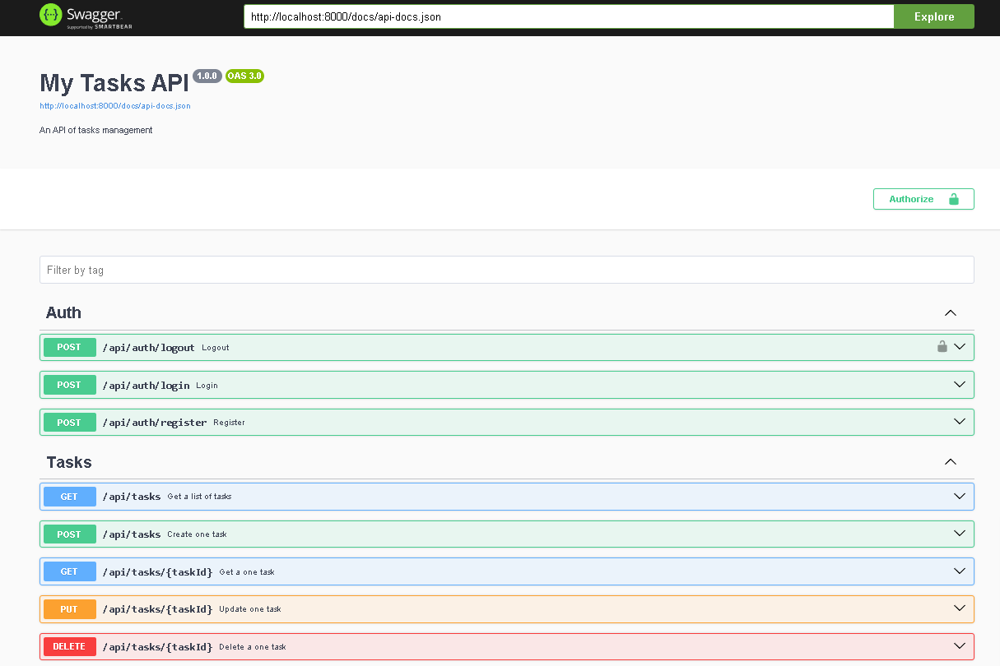
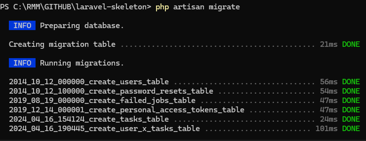
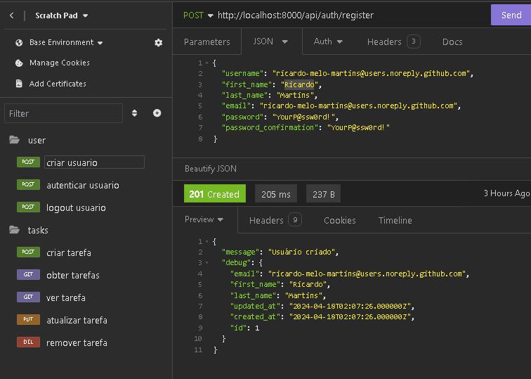

# laravel-skeleton

Laravel 9.x skeleton for fun development.

## Features

- User Register, Login, Logout
- JWT using with PHPOpenSourceSaver
- Event-driven on Register
- Todo/Task List Crud example
- Cache with Redis on Tasks Lists
- Validators on Requests (Controller)
- Spatie for Dto transactions (Services)
- OpenApi Documentation with Swagger
- Modular Structure (Auth, Public, Users and Tasks)
- Multi-Language configured (pt_BR, en)
- Centralized common function, abstract class...

## Requirements

- PHP > 8.1
- Extensions
  - curl, intl, mbstring, pdo_mysql, gd
- Composer 2.x
- Database (Mysql, Postgres)
- Redis (Optional)
- Docker > 18.06 (Optional)
    - For testing Database and Redis
      - https://github.com/ricardo-melo-martins/docker
    

## Endpoints




## Install

Cloning

```bash
git clone https://github.com/ricardo-melo-martins/laravel-skeleton.git
```

... enteing on laravel-skeleton dir

```bash
cd laravel-skeleton

composer install


# make it yours (optional)
rm -rf .git

```


## Configure

Copy example environment

```bash

cp ./.env.example .env

```

then change the configuration according to the database you want to use.

### Database

```bash

DB_CONNECTION=mysql
DB_HOST=127.0.0.1
DB_PORT=3307
DB_DATABASE=my_database
DB_USERNAME=root
DB_PASSWORD=YourP@ssw0rd!

```

Connection verify example...

```bash

php artisan migrate --pretend 

# if connection ok run command

php artisan migrate

```

Migrations Results




### Seed data

Populate database

```bash

php artisan db:seed 

```

### JWT

Get hash Jwt fo environment config

```bash

php artisan jwt:secret

# Results
# jwt-auth secret [<<get your hash>>] set successfully.
# place on .env file

JWT_SECRET=<<get your hash>>

```


## Testing

Change Environments 

```
# enable populate database using db:seed
TESTS_ENABLED=true

# enable db:seed fake data (factory) 
TESTS_SEED_DATA_FAKE=true

# change to validate
TESTS_USER_USERNAME=admin.test
TESTS_USER_EMAIL=email@tests.com
TESTS_USER_PASSWORD=YourP@ssw0rd!

```





```bash

# Register

curl --request POST \
  --url http://localhost:8000/api/auth/register \
  --header 'Accept: application/json' \
  --data '{
	"username": "rmm",
	"first_name": "Ricardo",
	"last_name": "Martins",
	"email": "test@email.com",
	"password": "YourP@ssw0rd!",
	"password_confirmation": "YourP@ssw0rd!"
}'


# Authenticate

curl --request POST \
  --url http://localhost:8000/api/auth/login \
  --header 'Accept: application/json' \
  --data '{
	"email": "test@email.com",
	"password": "YourP@ssw0rd!"
}'

# Logout

curl --request POST \
  --url http://localhost:8000/api/auth/logout \
  --header 'Accept: application/json' \
  --header 'Authorization: Bearer <Paste hash here>'


# TASKS

# Create

curl --request POST \
  --url http://localhost:8000/api/tasks \
  --header 'Accept: application/json' \
  --header 'Authorization: Bearer <Paste hash here>' \
  --data '{
	"name":"Nome bacana de tarefa para resolver logo",
	"description": "descricao mais mió di bão",
	"status": "pendente"
}'

# List

curl --request GET \
  --url http://localhost:8000/api/tasks \
  --header 'Accept: application/json' \
  --header 'Authorization: Bearer <Paste hash here>'


# Read

curl --request GET \
  --url http://localhost:8000/api/tasks/1 \
  --header 'Accept: application/json' \
  --header 'Authorization: Bearer <Paste hash here>'


# Update

curl --request PUT \
  --url http://localhost:8000/api/tasks/1 \
  --header 'Accept: application/json' \
  --header 'Authorization: Bearer  <Paste hash here>' \
  --data '{
	"name":"Novo título",
	"description": "Nova descrição para testes",
	"status": "finalizado"
}'


# Delete

curl --request DELETE \
  --url http://localhost:8000/api/tasks/1 \
  --header 'Accept: application/json' \
  --header 'Authorization: Bearer  <Paste hash here>'


```


## License
Yes ... its free here.

with fun and ❤️ por Ricardo Melo Martins.
